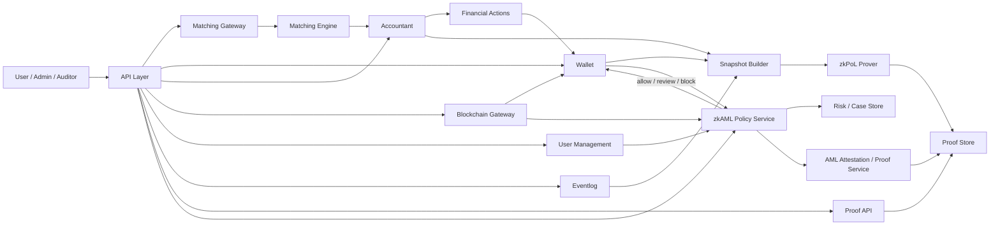

# OPEX zkPoL / zkAML Integration Architecture

This document captures the recommended integration design for building a forked OPEX-based exchange with:

- `zkPoL`: zero-knowledge proof of liabilities / solvency workflows
- `zkAML`: zero-knowledge assisted AML / policy enforcement workflows

The goal is to preserve OPEX's existing exchange core while attaching zk systems at stable service boundaries.

## Design Principles

1. Keep the matching path fast.
2. Treat zk proving as asynchronous wherever possible.
3. Use wallet and blockchain boundaries for AML gating.
4. Use accountant, wallet, and eventlog data for solvency snapshots.
5. Avoid patching the matching engine unless absolutely necessary.

## Relevant OPEX Boundaries

The current fork already exposes the boundaries we need:

- `matching-engine`: order matching
- `accountant`: order reservation, trade settlement intent, fee actions
- `wallet`: wallet balances, deposits, withdrawals, user transaction history
- `bc-gateway`: on-chain transfer sync and deposit propagation
- `eventlog`: order/trade event persistence
- `user-management`: KYC level and user compliance state
- `api`: public and client-facing aggregation layer

## Recommended High-Level Architecture

## External Repository Alignment

The actual repositories already exist outside this fork:

- `../zkPoL` at `/Users/hoh/Documents/Projects/zkPoL`
- `../zkAML` at `/Users/hoh/Documents/Projects/zkAML`

Their integration model is different and should be respected:

- `zkPoL` is a dedicated Rust proof pipeline that reads external ledger events from its own database tables and exposes proof / pipeline APIs.
- `zkAML` is a separate FastAPI product that exposes screening, alerts, and case workflows over HTTP.

This means the right integration strategy is:

- `OPEX -> zkPoL`: database event export / replication adapter
- `OPEX -> zkAML`: HTTP screening / case adapter

Do not try to embed either codebase directly into OPEX modules.

## Existing Code Paths We Should Reuse

### 1. Order reservation and trade settlement

`accountant` already creates and persists `FinancialAction` records for:

- order creation reserve from `MAIN -> EXCHANGE`
- order cancel / reject return from `EXCHANGE -> MAIN`
- trade settlement from `EXCHANGE -> MAIN`
- fee handling

Key files:

- `accountant/accountant-core/.../OrderManagerImpl.kt`
- `accountant/accountant-core/.../TradeManagerImpl.kt`
- `accountant/accountant-ports/.../FinancialActionPersisterImpl.kt`
- `wallet/wallet-app/.../FinancialActionEventListenerImpl.kt`

This is the cleanest source of truth for solvency-related balance transitions.

### 2. User-facing balance and transaction history

`wallet` already maintains:

- wallet balances
- deposit and withdraw records
- user transaction history
- aggregate wallet stats endpoints

Key files:

- `wallet/wallet-core/.../TransferManagerImpl.kt`
- `wallet/wallet-core/.../WithdrawService.kt`
- `wallet/wallet-app/.../WalletStatController.kt`
- `wallet/wallet-ports/.../UserTransactionManagerImpl.kt`

These are ideal inputs for zkPoL snapshot extraction.

### 3. On-chain deposit ingestion

`bc-gateway` already syncs observed chain transfers and forwards deposits to wallet:

- `bc-gateway/bc-gateway-core/.../WalletSyncServiceImpl.kt`

This is the right deposit-side insertion point for zkAML screening.

### 4. Event audit trail

`eventlog` persists order and trade events:

- `eventlog/.../EventPersisterImpl.kt`
- `eventlog/.../OrderPersisterImpl.kt`

This gives us replay / audit support and a defensible source for proof snapshots.

## zkPoL Integration

### What zkPoL should prove

For MVP, zkPoL should focus on liabilities first:

- user balances included in a snapshot
- each user can verify leaf inclusion
- auditor can verify total liabilities commitment

Assets can initially be attached as signed attestations or wallet inventory exports, then upgraded to stronger proofs later.

### Recommended new components

Create new modules or services:

- `zk/zkpol-snapshot-service`
- `zk/zkpol-prover-service`
- `zk/zkproof-api`

In practice, because `zkPoL` already exists as a separate repo, these should be interpreted as OPEX-side adapters, not as replacement proving code inside this fork.

Recommended OPEX-side additions:

- `zk-integration/zkpol-exporter`
- `zk-integration/zkpol-admin-client`
- `zk-integration/zkpol-read-client`

### Snapshot inputs

The snapshot builder should consume:

- wallet balances from wallet data / wallet totals
- user transaction history for auditability
- financial actions from accountant for settlement lineage
- eventlog trade / order events for replay and reconciliation
- withdraw / deposit records to account for cashflow around the cutoff point

For the current `zkPoL` repository, the direct input contract is not an HTTP append API. It expects external ledger events to be inserted into its `ledger_change_event` table and then processed by bootstrap / assemble / prove / submit / finalize flows.

That means OPEX must produce a normalized liability event stream that can be loaded into `zkPoL` storage.

### Snapshot strategy

Use a fixed snapshot boundary such as:

- snapshot ID
- cutoff timestamp
- included currencies
- inclusion rules for system wallets

Recommended outputs:

- per-currency liabilities tree
- per-user leaf records
- aggregate liability totals
- reconciliation metadata
- proof artifacts and verifier inputs

### Where it plugs into OPEX

Do not run proofs inside the matching flow.

Instead:

1. extract a consistent ledger snapshot from wallet/accountant/eventlog
2. normalize balances per asset
3. build Merkle trees / commitments
4. generate proofs asynchronously
5. expose results through a dedicated proof API

### Actual zkPoL adapter strategy

`zkPoL` today expects:

- token bootstrap via admin API
- subsequent liability deltas via database-backed `ledger_change_event`
- proof and status reads via public/admin/internal HTTP APIs

So the OPEX-side implementation should be:

1. Define a canonical export record for liability deltas.
2. Build an exporter that writes OPEX balance transitions into an internal `zkpol_liability_outbox` table and optionally mirrors JSONL for debugging.
3. Run a bridge that consumes the outbox and inserts mirrored rows into `zkPoL`'s external event table.
4. Bootstrap a token in `zkPoL` when a supported asset is activated.
5. Trigger or monitor `zkPoL` schedulers through its admin APIs.
6. Surface proof results back into OPEX admin/public views through a thin client.

Current implementation note:

- the OPEX-side bridge lives at `core/tools/zkpol_bridge/zkpol_bridge.py`
- it reads Postgres `zkpol_liability_outbox`
- it writes deterministic ids into `zkPoL.ledger_change_event`
- it tracks progress in Postgres `zkpol_bridge_state`

### Canonical zkPoL event mapping

OPEX has several possible sources, but the safest initial source is user wallet balance change history enriched with accountant action lineage.

Recommended mapping:

- `token_id`: OPEX asset symbol such as `USDT`
- `account_id`: OPEX user UUID
- `balance`: post-change user liability balance for that asset
- `delta`: signed balance change
- `event_type`: deposit / withdraw / trade / fee / adjustment
- `occurred_at`: OPEX event timestamp

Recommended source priority:

1. `wallet` user transactions for user-visible balance changes
2. `accountant` financial actions for settlement lineage
3. `eventlog` for replay and dispute resolution

The first production-safe milestone is not full replication of every internal state transition. It is deterministic export of user liability changes for a selected asset set.

### First implementation target

The fastest path is:

1. add a read-only snapshot export service
2. generate deterministic JSON snapshot artifacts
3. later attach prover execution to those artifacts

That lets us validate data quality before proof system work.

## zkAML Integration

### What zkAML should do

`zkAML` should act as a policy decision layer, not a replacement matching engine.

It should decide:

- whether an inbound deposit is creditable
- whether a withdraw request is allowed
- whether a withdraw needs review
- whether a user action requires stronger KYC

### Recommended new components

- `zk/zkaml-policy-service`
- `zk/zkaml-proof-service`
- `zk/zkaml-case-api`

In practice, because `zkAML` already exists as a separate repo, the OPEX fork should add clients and policy adapters rather than re-implement the AML platform.

Recommended OPEX-side additions:

- `zk-integration/zkaml-client`
- `zk-integration/zkaml-policy-adapter`
- `zk-integration/zkaml-case-linker`

### Deposit-side integration

Insert a pre-credit screening step into `WalletSyncServiceImpl`.

Current behavior:

1. chain transfer is detected
2. assigned address resolves to user
3. `walletProxy.transfer(...)` credits the user
4. deposit record is saved

Recommended behavior:

1. chain transfer is detected
2. assigned address resolves to user
3. call `zkAMLPolicyService.evaluateDeposit(...)`
4. if `ALLOW`, continue with current flow
5. if `REVIEW`, persist pending/risk case in `zkaml_deposit_case` and do not auto-credit
6. if `BLOCK`, persist blocked deposit case in `zkaml_deposit_case` and do not auto-credit

For the current `zkAML` repository, the most immediate HTTP fit is:

- `POST /screen/address`
- `POST /screen/tx`

That means deposit screening can use:

- `screen/address` before address assignment or at address watch time
- `screen/tx` when a concrete on-chain deposit transaction hash is known

### Withdraw-side integration

Insert checks into `WithdrawService.requestWithdraw(...)` before moving funds into `CASHOUT`.

Current behavior:

1. validate wallet and chain params
2. move funds from `MAIN -> CASHOUT`
3. persist withdraw in `CREATED`

Recommended behavior:

1. validate wallet and chain params
2. call `zkAMLPolicyService.evaluateWithdraw(...)`
3. if `ALLOW`, continue normal flow
4. if `REVIEW`, persist a `zkaml_withdraw_case` record and reject before funds move
5. if `BLOCK`, persist a `zkaml_withdraw_case` record and reject before funds move

Add a second optional AML check before `acceptWithdraw(...)` for final payout approval.

For the current `zkAML` repository, the immediate withdraw fit is:

- screen destination address using `POST /screen/address`
- optionally create or link an alert/case in `zkAML` when policy requires review

Because `zkAML` is operator-oriented, a blocked or review-required withdrawal should preserve enough OPEX metadata to deep-link analysts into the corresponding `zkAML` case.

### KYC and AML state

There is already a `KycLevelUpdatedEvent` flowing through the system. Reuse that as part of AML policy context rather than inventing a parallel identity state.

Recommended policy inputs:

- user UUID
- KYC level
- asset / chain / address
- tx hash / address metadata
- amount and rolling exposure
- sanctions / risk vendor signals
- internal case history

### Proof / attestation model

For early versions, `zkAML` does not need a full zk circuit for every policy branch.

A practical progression is:

1. policy engine computes a decision
2. store decision inputs in a protected case store
3. produce a compact attestation / proof artifact
4. expose only the minimum verification artifact externally

This preserves the ability to evolve into stronger zero-knowledge guarantees later.

### Actual zkAML adapter strategy

Recommended request usage from OPEX:

- deposits:
  - `POST /screen/tx` with `{ chain, tx_hash }`
  - fallback `POST /screen/address` with `{ chain, address }`
- withdrawals:
  - `POST /screen/address` with destination chain and address

Recommended OPEX-side decision envelope:

- `ALLOW`
- `REVIEW`
- `BLOCK`

Recommended persistence in OPEX for every non-allow decision:

- external AML system name
- external screening request payload digest
- external decision summary
- linked alert or case id when available
- last screening timestamp

## Suggested Service Boundaries

### New read-only integration points

- `wallet stats` for balances
- `user transaction history`
- `withdraw and deposit history`
- `eventlog order/trade reads`
- `financial action export`

### New write-path integration points

- `bc-gateway -> wallet` deposit credit path
- `wallet withdraw request`
- `wallet withdraw accept`
- `OPEX -> zkPoL exporter`
- `OPEX -> zkAML screening client`

### Keep unchanged for now

- `matching-engine`
- `matching-gateway`
- order matching protocol

## Concrete MVP Roadmap

### Phase 1: Read-only zkPoL data pipeline

1. Add an OPEX-side liability export service.
2. Export user liability changes for one asset such as `USDT`.
3. Mirror those changes into `zkPoL`-compatible event rows.
4. Bootstrap the same asset as `token_id` in `zkPoL`.
5. Verify `zkPoL` can finalize batches from mirrored OPEX data.

### Phase 2: zkPoL proving

1. Add a small admin client for `zkPoL` bootstrap / scheduler status.
2. Read `zkPoL` summary, pipeline, account, and proof APIs from OPEX admin.
3. Add user self-verification links or embedded proof views.
4. Reconcile OPEX wallet totals with `zkPoL` token summaries.
5. Expand from one asset to multiple assets.

### Phase 3: zkAML withdraw gate

1. Add `zkAMLPolicyService` interface backed by HTTP client.
2. Call it inside `WithdrawService.requestWithdraw(...)`.
3. Screen destination address through `zkAML`.
4. Add decision states: allow / review / block.
5. Persist external screening refs and linked case ids.

### Phase 4: zkAML deposit gate

1. Add policy call inside `WalletSyncServiceImpl`.
2. Screen tx hash with `zkAML` before credit.
3. Prevent unsafe auto-crediting.
4. Persist pending deposit cases and analyst links.
5. Add admin approval / release flow.

## Recommended First Coding Targets

If we start implementation immediately, the first changes should be:

1. Create a `zk-integration` area in the OPEX fork.
2. Add a small `zkaml-policy` interface plus an HTTP-backed adapter stub.
3. Wire that adapter into `WithdrawService.requestWithdraw(...)`.
4. Add an OPEX-to-`zkPoL` export schema and one-asset JSONL outbox exporter prototype.

That order gives us:

- a stable architecture target
- low-risk integration first
- room to iterate on the proof system independently

## Notes on Fork Strategy

- Use `origin` only for pushes.
- Use `upstream` only for fetching and rebasing selected changes.
- Keep all zk-specific code in new modules or clearly isolated packages.
- Avoid deep invasive patches until the snapshot and AML boundaries are proven.
